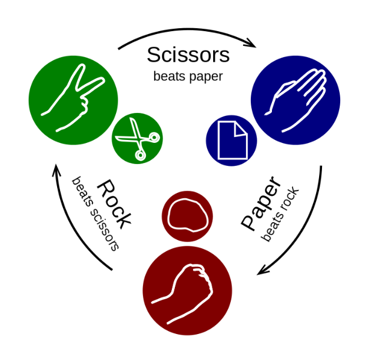
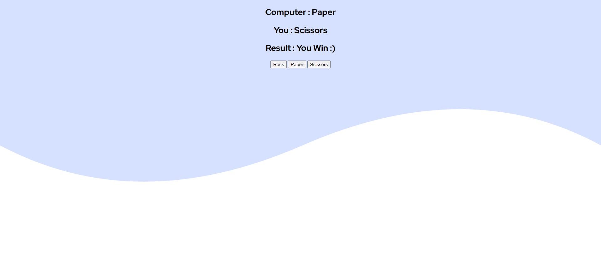

# Rock-Paper-Scissor 👋
This is a practice project in which I tried to make a sample page using just HTML, CSS and JavaScript. 

I made this in order understand the concepts of JavaScript.

## Table of contents
- [Overview](#overview)
    - [How to play ?](#rock-paper-and-scissors-game) ✌️
    - [Screenshot](#screenshot) 📷
    - [Demo Game](#demonstration) 🎮

- [My process](#my-process)
    - [Built with](#built-with) 🚀
    - [What I learned](#what-i-learned)💡
    - [Continued development](#continued-development) 🛠️
    - [Useful resources](#useful-resources) 📚

## Overview 
### Rock Paper and Scissors Game
It is a simple hand game usually played between two people,  in which each player simultaneously forms one of three shapes with an outstretched hand. 

### Screenshot

  
### Demonstration  

## My process
### Built with
- HTML5
- CSS
- Vanilla JavaScript

### What I learned
In this project I tried to understood how JavaScript encorporates the logic build in HTML and CSS. 

I learnt a quite about `eventListener`, `querySelectors`, `callback` functions  and ` Document Object Model` via `innerHTML`  in this project. 

And how to add the `Math` functions in JS in order to create the logic for the game.

### Continued development
I have done this project in order to understand the concepts of CSS and JavaScript. I will be creating another project with similar idea and try to do more CSS encoding and to deal with more complex problems regarding the same.

### Useful resources
- [Wikipedia](https://en.wikipedia.org/wiki/Rock_paper_scissors)
- [freeCodeCamp](https://www.freecodecamp.org/)
- [MDN Web Docs](https://developer.mozilla.org/) 
- [W3Schools](https://www.example.com)